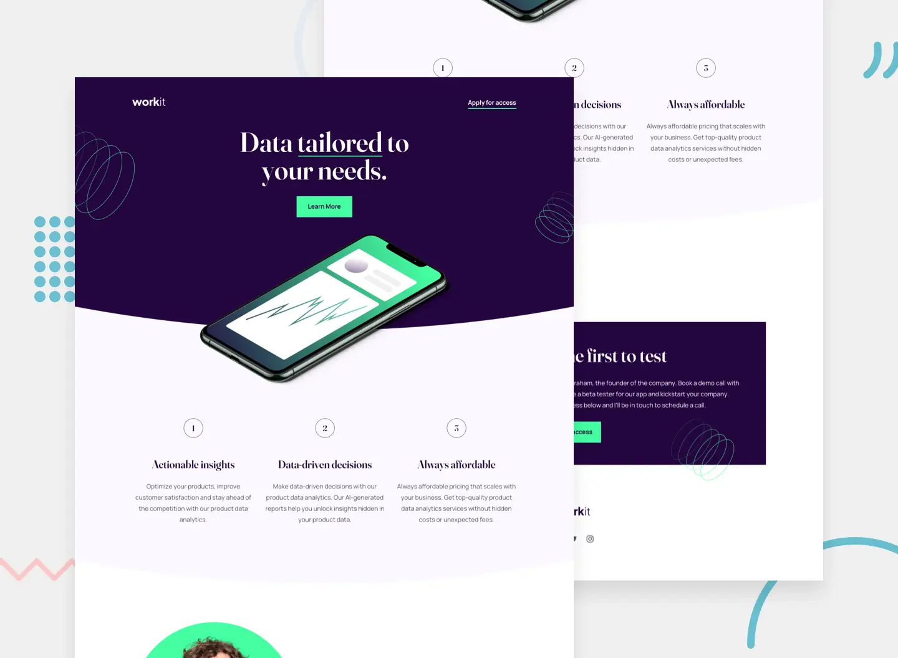

# Hi 👋 there!

So glad you've dropped by my coding corner. Here, it's all about web design,
coding magic.

Between coding sessions, I'm probably out cycling 🚴‍♂️ or having fun annoying my
kids (they secretly love it😁!).

Dive 👀 into my projects, see what sparks joy, and let's chat 💬 about anything
from tech to the best cycling routes.

Happy exploring!

# Project: WorkIt - Landing Page

[Frontend Mentor](https://www.frontendmentor.io) challenges that help to improve
coding skills by building realistic projects.

### Requirements

Users should be able to:

- View the optimal layout for the interface depending on their device's screen
  size
- See hover and focus states for all interactive elements on the page

### Tech Stack:

- HTML;
- CSS;
- JavaScript;
- Vite;

### Links

- Solution URL:
  [FrontendMentor Challenge Hub](https://www.frontendmentor.io/challenges/workit-landing-page-2fYnyle5lu)
- Live Site URL: [GitHub Pages](grifano.github.io/fm-workit-landing-page/)

## Author

- Website - [Serhii "Grifano" Orlenko](https://grifano.com)
- Uxcel - [Design](https://app.uxcel.com/ux/EE4PBID94EEH)
- Frontend Mentor -
  [Web Development](https://www.frontendmentor.io/profile/SO-Grifano)
- Twitter - [@OrlenkoSerhii](https://twitter.com/OrlenkoSerhii)
